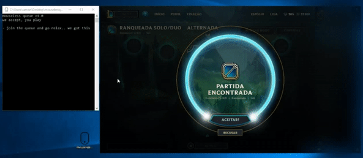

# mouselessqueue
Automatically accept your League of Legends queues



## Build it

```
pip install -r requirements.txt
pyinstaller --onefile --ico=etc/ico.ico mouselessqueue/__main__.py
```
Currently only supported on Windows

## Contribute
Contributions are always welcome, please do it.

## License
This project is licensed under the MIT License - see the [LICENSE](LICENSE) file for details
